  

 

  <a href="https://www.linkedin.com/in/shubham-kumar-diff/">LinkedIn</a>&nbsp;&nbsp;·&nbsp;&nbsp;
  <a href="https://nothing0g.github.io/analyst/">Analyst portfolio</a>&nbsp;&nbsp;·&nbsp;&nbsp;
  <a href="mailto:shubham1sure@gmail.com">Email</a>

# Shubham Kumar

### I make useful things from messy inputs.

I am an engineer moving into **data and business analysis**. I use data, product thinking, and a bit of vibe coding to turn unclear problems into tools and decisions that are actually useful.

> **Vibe coding is my starting point. Standards are my filter.**
>
> I am not here to produce AI slop, ad farms, or features looking for a problem. I want to make good things that earn their existence.

## Selected work / `CASE_FILES`

Each case below is a live module. **Hover the linked card for the native GitHub link state, click the card to open the repository, or expand `inspect case` to read the finding without leaving this page.** The animation is not decoration: the pulse means the case is active, the bar shows the state of the investigation, and the signal line points toward the outcome.

<table>
<tr>
<td width="50%" valign="top">

inspect case →

Overtime employees churn at **3×** the base rate — **31%** versus **10%**. I chose Logistic Regression over Random Forest for **56% recall** on at-risk employees: the metric that mattered, not the one that looked best.

[open repository →](https://github.com/Nothing0g/hr_employee_attrition_analysis)

</td>
<td width="50%" valign="top">

inspect case →

Demand swings **9×** by hour, yet a flat **25% failure rate** holds across every hour. The answer is not only more supply at peak time; it is fixing the system underneath.

[open repository →](https://github.com/Nothing0g/Uber_ride_demand_analysis)

</td>
</tr>
<tr>
<td width="50%" valign="top">

inspect case →

A classification pipeline for surfacing approval risk before decisioning, with the analysis kept readable enough to support a real conversation beyond the notebook.

[open repository →](https://github.com/Nothing0g/loan-approval-analysis)

</td>
<td width="50%" valign="top">

inspect case →

I surveyed **200 students**, identified lack of motivation as the core dropout driver, and built an MVP around one lever: competition. The work was recognized at Dell Aspire.

[open repository →](https://github.com/Nothing0g/My_python.projects)

</td>
</tr>
</table>

## How I work

<table>
<tr>
<td width="33%" valign="top">
<strong>Make it useful.</strong>  
A project should help someone decide, build, understand, or move faster. Otherwise it is decoration.
</td>
<td width="33%" valign="top">
<strong>Make it clear.</strong>  
A model is not finished when it runs. It is finished when the result can survive outside the notebook.
</td>
<td width="33%" valign="top">
<strong>Make it real.</strong>  
Small, thoughtful tools beat ten disposable demos. I care about the last mile between insight and impact.
</td>
</tr>
</table>

## Tools I reach for

  

`pandas` &nbsp; `scikit-learn` &nbsp; `Power BI` &nbsp; `Excel` &nbsp; `AutoCAD` &nbsp; `ANSYS` &nbsp; `SolidWorks`

## Currently

Building analyst-track projects through a CrackNonTech fellowship. Previously: **Engineers India Ltd · DRDO-SSPL · NTPC Dadri**. Open to **Data Analyst** and **Business Analyst** roles where clear thinking matters as much as clean execution.

  
  
  

## Let’s build something that matters

Have a messy problem, an interesting dataset, or a useful idea that needs shipping? **[Let’s talk.](mailto:shubham1sure@gmail.com)**

  <code>case_status: investigating</code>&nbsp;&nbsp;·&nbsp;&nbsp;built with curiosity, evidence, and a suspicious amount of coffee.

