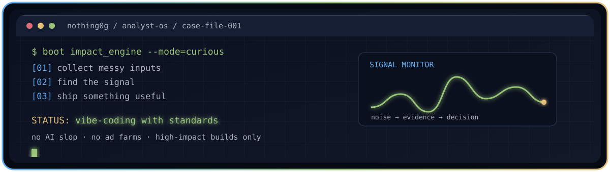

  

 

  
  
  
  

<h1 align="center">Shubham Kumar · Nothing0g</h1>

  <strong>Vibe coder. Data analyst. Builder of things that earn their existence.</strong> 
  I turn messy inputs into useful decisions, practical tools, and shipped work.

`vibe coding` + `analytical rigor` + `mechanical precision` → **impact**

> I vibe-code, but I do not ship AI slop. I build good, impactful things instead of noise, ad farms, or features looking for a problem.

## `whoami`

I am an engineer moving deeper into data and business analysis. My workflow is simple: get curious, interrogate the data, find the signal, and make the result useful to someone other than myself.

Currently, I am building analyst-track projects through a CrackNonTech fellowship. Previously, I worked with Engineers India Ltd, DRDO-SSPL, and NTPC Dadri. I am open to **Data Analyst** and **Business Analyst** opportunities where clear thinking matters as much as clean execution.

## `case_files/`

<table>
<tr>
<th align="left">case</th>
<th align="left">finding</th>
<th align="left">tools</th>
</tr>
<tr>
<td><strong>CF-001 HR Attrition</strong> decision intelligence</td>
<td>Overtime employees churn at <code>3×</code> the base rate — <code>31%</code> vs <code>10%</code>. Chose Logistic Regression over Random Forest for <code>56%</code> recall on at-risk employees: the metric that mattered, not the one that looked best.</td>
<td><code>Python</code> <code>scikit-learn</code> <a href="https://github.com/Nothing0g/hr_employee_attrition_analysis">open case →</a></td>
</tr>
<tr>
<td><strong>CF-002 Uber Demand</strong> operations analytics</td>
<td>Demand swings <code>9×</code> by hour, yet a flat <code>25%</code> failure rate holds across every hour. The fix is not just peak-hour supply; it is structural reliability.</td>
<td><code>Python</code> <code>pandas</code> <a href="https://github.com/Nothing0g/Uber_ride_demand_analysis">open case →</a></td>
</tr>
<tr>
<td><strong>CF-003 Loan Approval</strong> risk classification</td>
<td>A classification pipeline designed to surface approval risk before decisioning, with the analysis kept readable enough to support an actual conversation.</td>
<td><code>Python</code> <a href="https://github.com/Nothing0g/loan-approval-analysis">open case →</a></td>
</tr>
<tr>
<td><strong>CF-004 CultFit Behavior</strong> product discovery</td>
<td>Surveyed <code>200</code> students, isolated lack of motivation as the core dropout driver, and built an MVP around one lever: competition. Recognized at Dell Aspire.</td>
<td><code>Thunkable</code> <a href="https://github.com/Nothing0g/My_python.projects">open case →</a></td>
</tr>
</table>

## `stack/`

  

  
  
  
  
  
  
  

| Layer | What I use it for |
|---|---|
| **Query** | SQL and Python for asking better questions of imperfect data. |
| **Model** | pandas and scikit-learn for analysis, classification, and decision support. |
| **Explain** | Power BI, Excel, and clear writing for turning findings into action. |
| **Build** | GitHub, Figma, VS Code, and a healthy amount of vibe coding. |

## `operating_principles/`

| Principle | Translation |
|---|---|
| **Useful over impressive** | If it does not help someone decide, build, or understand, it probably does not need to ship. |
| **Evidence over vibes** | Vibe coding is the starting energy; validation is the finishing discipline. |
| **Small surface, real impact** | I would rather make one thoughtful tool than ten disposable demos. |
| **Explain the why** | A model is not finished until the result can survive outside the notebook. |

## `telemetry/`

  

  
  

  

  

<picture>
  <source media="(prefers-color-scheme: dark)" srcset="https://raw.githubusercontent.com/Nothing0g/Nothing0g/output/github-snake-dark.svg" />
  
</picture>

## `credentials/`

  
  
  

## `connect/`

If you have a messy problem, an interesting dataset, or a useful idea that needs shipping, reach out. I am always more interested in **what can be made better** than in adding another empty feature to the internet.

  <a href="https://www.linkedin.com/in/shubham-kumar-diff/">LinkedIn</a> ·
  <a href="mailto:shubham1sure@gmail.com">Email</a> ·
  <a href="https://nothing0g.github.io">Portfolio</a> ·
  <a href="https://nothing0g.github.io/analyst/">Analyst portfolio</a>

<code>case_status: investigating</code> · built with curiosity, evidence, and a suspicious amount of coffee.
