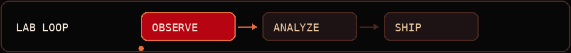
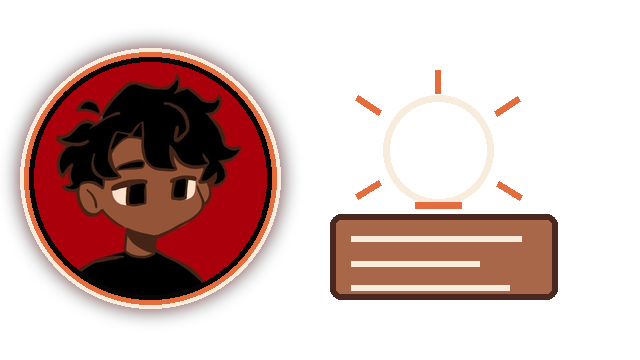
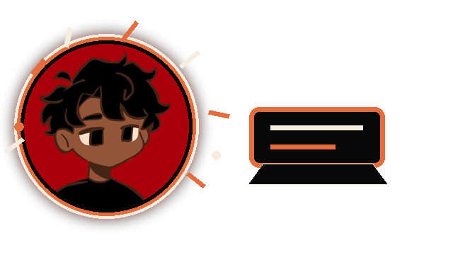
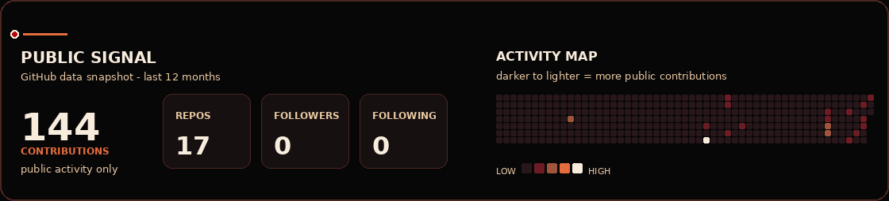

  
  <h2><code>WELCOME TO THE LAB</code></h2>
  
<strong>Turning messy inputs into useful work.</strong>

  

 

<table>
  <tr>
    <td width="31%" align="center" valign="middle">
      
    </td>
    <td width="69%" valign="middle">
      <h1>Shubham Kumar <code>Nothing0g</code></h1>
      
<strong>Engineer → data &amp; business analysis</strong>

      
I turn messy inputs into useful tools, clear analysis, and decisions that can survive outside the notebook.

      

        
        
        
      

    </td>
  </tr>
</table>

  
  
  

---

## `about_me.log`

I’m an engineer moving into **data and business analysis**. I use **Python-driven analysis**, **product thinking**, and a little vibe coding to make unclear problems more useful. I care about the last mile: not just getting a model or notebook to run, but making the result clear enough to support a real decision.

> **Vibe coding is my starting point. Standards are my filter.** I’m here to make useful things from messy inputs — not features looking for a problem.

<table>
  <tr>
    <td width="64%" valign="top">
      <h3>What I am working around</h3>
      
My public work is focused on applied analyst projects: operations demand, employee attrition, loan approval, and small Python builds. The newest public repository activity also includes a browser-first, GitHub Pages-ready static project.

    </td>
    <td width="36%" align="center" valign="middle">
      
    </td>
  </tr>
</table>

---

## `case_files/selected_work`

  

<table>
  <tr>
    <td width="50%" valign="top">
      
      <h3>CF-001 · Uber demand</h3>
      
<a href="https://github.com/Nothing0g/Uber_ride_demand_analysis"><strong>Uber_ride_demand_analysis</strong></a>

      
Operations and demand analysis across 150K Uber ride bookings, covering hourly demand patterns, cancellation diagnostics, and operational recommendations with Python, pandas, and matplotlib.

    </td>
    <td width="50%" valign="top">
      
      <h3>CF-002 · People analytics</h3>
      
<a href="https://github.com/Nothing0g/hr_employee_attrition_analysis"><strong>hr_employee_attrition_analysis</strong></a>

      
Exploratory analysis and classification modeling for employee attrition, paired with business recommendations and an evidence-backed Python workflow.

    </td>
  </tr>
  <tr>
    <td width="50%" valign="top">
      
      <h3>CF-003 · Loan approval</h3>
      
<a href="https://github.com/Nothing0g/loan-approval-analysis"><strong>loan-approval-analysis</strong></a>

      
A published Jupyter Notebook project for loan approval analysis.

    </td>
    <td width="50%" valign="top">
      
      <h3>CF-004 · Browser-first build</h3>
      
<a href="https://github.com/Nothing0g/the-uncomfortable-list"><strong>the-uncomfortable-list</strong></a>

      
A recent React-tagged, local-only static project built for the browser and ready for GitHub Pages.

    </td>
  </tr>
</table>

---

## `stack.detected()`

These are the tools and technologies evidenced by public repository metadata and the selected projects above.

  
  
  
  
  
   
  
  
  
  
  
  

  

---

## `public_signal`

  
   
  Local public-data snapshot · <a href="https://github.com/Nothing0g">view the live GitHub contribution history</a>

---

<table>
  <tr>
    <td width="72%" valign="middle">
      <h2><code>currently_exploring</code></h2>
      
I’m continuing analyst-track case work and experimenting with browser-first static builds. If you have a messy problem, an interesting dataset, or a useful idea that needs shipping, <a href="mailto:shubham1sure@gmail.com"><strong>let’s talk</strong></a>.

      <code>status: curious · evidence-first · coffee-fueled</code>
    </td>
    <td width="28%" align="center" valign="middle">
      
    </td>
  </tr>
</table>

  Built around the original Nothing0g character — deep red, black, warm brown, and cream.

